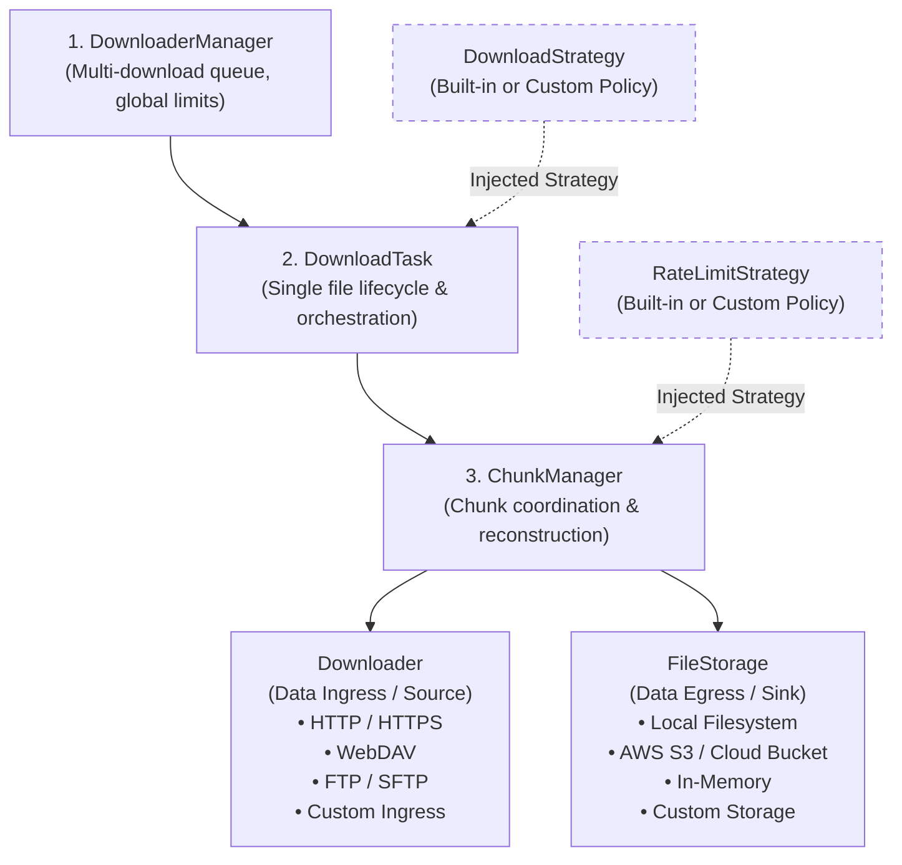

# SDownload

> **Modern, Cloud-Native, Asynchronous Python Download Engine**  
> *Status: 🚧 Under Active Development (Alpha)*

[](https://www.python.org/downloads/)
[]()
[]()

**SDownload** is a high-performance, asynchronous download library for Python 3.12+. It is designed from the ground up to be **100% embeddable**, **crash-resilient**, and **serverless/cloud-ready** (e.g., streaming directly into AWS S3 without local disk constraints).

Unlike legacy utilities (such as `aria2`), SDownload requires no background daemons or JSON-RPC subprocesses, eliminates heavy upfront disk pre-allocation, and uses graph-theoretic algorithms for zero-waste dynamic chunk splitting and byte reconstruction.

---

## 🏛️ High-Level Architecture

SDownload is structured into 4 decoupled layers using Hexagonal Architecture (Ports & Adapters):



For complete architectural details, see [docs/architecture.md](docs/architecture.md).

---

## 🚀 Key Differentiators

- **100% Native & Embeddable:** Pure Python 3.12+ `asyncio` library with complete type hints. No external C++ daemons, no RPC overhead.
- **Serverless & Cloud-Native Ready:** Ingress (`Downloader`) and Egress (`FileStorage`) are decoupled protocols. Stream directly from HTTP into **AWS S3 / Cloud Storage** in AWS Lambda or Cloud Run with zero local disk usage.
- **Zero-Preallocation Footprint:** Does not lock 100% of the file size on disk upfront. Storage footprint grows dynamically as bytes arrive via streaming.
- **Atomic & Crash-Proof Recovery:** Recovers from abrupt process termination (`SIGKILL`, spot instance evictions, reboot). Validates physical storage state against atomic metadata (`.sdown_resume_<file_id>.json`).
- **Dynamic Work Stealing (`crop & move`):** When workers finish early while a slow connection lags, SDownload dynamically crops active chunks and splits remaining ranges without losing downloaded bytes.
- **Graph-Theoretic Assembly (Dijkstra):** Reconstructs files using shortest-path graph resolution to guarantee zero byte duplication or corruption.
- **Multi-Protocol Resource Discovery:** Built-in BFS crawler supporting HTML links, JSON APIs, and WebDAV XML `PROPFIND` directory trees.

For an in-depth comparison against traditional downloaders, read [docs/design_principles.md](docs/design_principles.md).

---

## 📊 Development Status & Roadmap

### ✅ Implemented & Tested (234 Tests Passing)

- [x] **Chunk Supervision & Concurrency:** `ChunkManager` with async context management and worker lifecycle.
- [x] **Dynamic Chunk Succession:** In-flight chunk cropping and worker succession (`run_chunk_succession`).
- [x] **Optimal Graph Reconstructor:** Dijkstra-based fragment solver (`calculate_optimal_coverage` & `reconstruct_file`).
- [x] **HTTP Streaming & Range Engine:** `HttpxDownloader` with proxy, SSL, cookies, and HTTP range streaming.
- [x] **Resource Discovery & Crawling:** BFS crawler with depth limits and Extractors (HTML, JSON, WebDAV XML `PROPFIND`).
- [x] **Rate Limiting & Throttling:** `TokenBucketThrottler` and `FixedWindowThrottler` for precision bandwidth regulation.
- [x] **Atomic State Recovery:** `RecoveryDownload` with state validation and automatic disk cleanup.
- [x] **Local Storage Engine:** `LocalStorage` with async binary streaming, `crop_file`, `shrink_file_to`, and `merge_ranges`.
- [x] **Exception Hierarchy:** Comprehensive typed error mapping (`CommunicationError`, `DataError`, `InfrastructureError`).

### 🚧 In Progress & Upcoming

- [ ] **Download Task Completion:** Finishing the single-file orchestrator (`DownloadTask`) linking `ChunkManager`, `DownloadStrategy`, and `RecoveryDownload`.
- [ ] **Multi-Download Pool:** Completing `DownloaderManager` for multi-file queue scheduling and global connection pools.
- [ ] **Cloud Storage Driver:** `S3Storage` adapter for direct multipart upload streaming.
- [ ] **High-Level Facade:** Simple one-liner public API (e.g., `sdownload.download(url, dest)`).
- [ ] **Interactive CLI:** Terminal user interface with live multi-chunk progress bars.

---

## 🧪 Running Tests

```bash
# Run all tests
.\venv\Scripts\pytest -v tests/

# Run a specific module
.\venv\Scripts\pytest -v tests/services/downloader_manager/
.\venv\Scripts\pytest -v tests/http_client/
```

---

## 📚 Documentation Index

- [Architecture Overview & Layer Breakdown](docs/architecture.md)
- [Design Principles & Philosophy](docs/design_principles.md)
- [Conceptual Mindmap & High-Level Flow](docs/mindmap.md)
