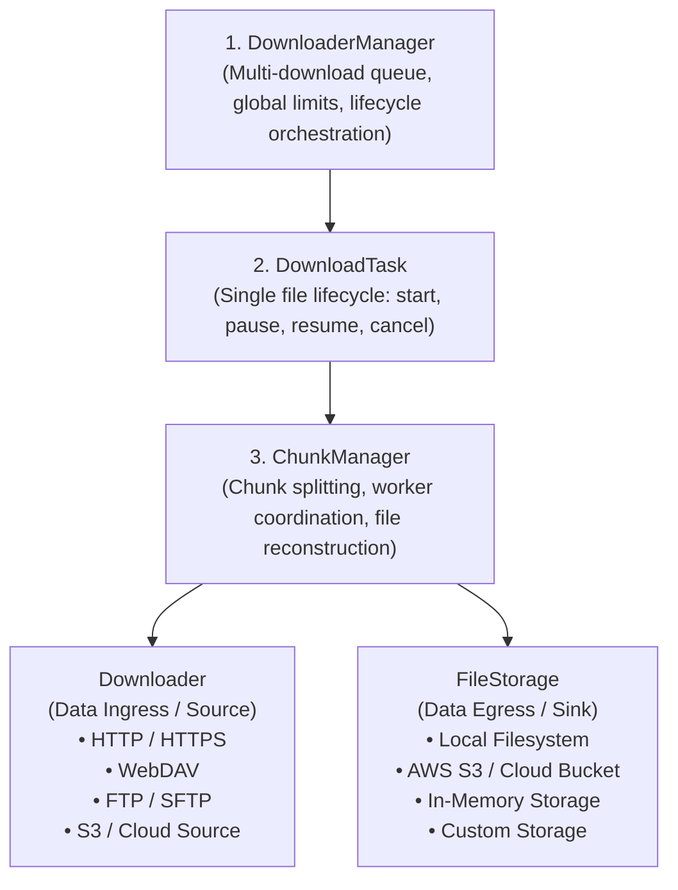

# SDownload Architecture Overview

This document presents the core architecture of the library, organized into hierarchical layers and pluggable infrastructure adapters.

---

## Architecture Diagram

---

## Layer Responsibilities

| Layer | Component | Primary Responsibility | Examples of Implementations |
|---|---|---|---|
| **1. Multi-Download** | `DownloaderManager` | Manages the global queue, concurrent file limits, and global bandwidth pooling. | `MultiChunkDownloaderManager`, `PriorityQueueManager` |
| **2. Single Download** | `DownloadTask` | Controls the complete lifecycle of one specific file download. | `DownloadTask` |
| **3. Chunk Coordination** | `ChunkManager` | Coordinates byte ranges (`ChunkRange`), workers, dynamic succession, and file merge. | `ChunkManager` |
| **4a. Ingress (Source)** | `Downloader` | Network interface to fetch ranged byte streams and query resource metadata. | `HttpxDownloader`, `WebdavDownloader`, `FtpDownloader`, `S3Downloader` |
| **4b. Egress (Sink)** | `FileStorage` | Persistence interface to save data streams, crop segments, and merge files. | `LocalStorage`, `S3Storage`, `MemoryStorage`, `AzureBlobStorage` |
