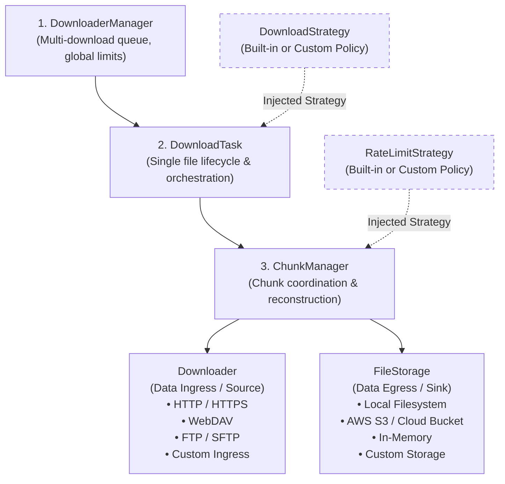

# SDownload Architecture Overview

This document describes the high-level architecture of **SDownload**, a modular, asynchronous download engine in Python.

---

## High-Level Architecture Diagram



---

## Core Layers & Responsibilities

### 1. Multi-Download Manager (`DownloaderManager`)
- **Role:** Orchestrates the global download pool across multiple files.
- **Responsibilities:**
  - Enqueues and prioritizes download jobs.
  - Controls global concurrency and connection balance.
  - Exposes batch operations (`start`, `pause`, `stop`, `wait_until_done`).

### 2. Single Download Task (`DownloadTask`)
- **Role:** Coordinates the entire lifecycle of a single target file.
- **Responsibilities:**
  - Resolves file metadata via `get_file_info` (detects file size, resumability, server Range support).
  - Handles lifecycle states: `PENDING`, `DOWNLOADING`, `PAUSED`, `CANCELLED`, `COMPLETED`, `ERROR`.
  - Consults the injected **`DownloadStrategy`** for chunk range decisions.
  - Manages recovery state persistence (`.sdown_resume_<file_id>.json`).

### 3. Chunk Coordination (`ChunkManager`)
- **Role:** Manages the active byte ranges (`ChunkRange`) and concurrent workers for one file.
- **Responsibilities:**
  - Spawns and supervises worker tasks for each chunk.
  - Coordinates dynamic chunk succession / work-stealing (`run_chunk_succession`).
  - Applies rate limiting per stream via the injected **`RateLimitStrategy`** (`Throttler`).
  - Merges and reconstructs completed chunks into the final target file using optimal graph coverage.

### 4. Pluggable Infrastructure Adapters (Ingress & Egress)
- **`Downloader` (Ingress / Source):**
  - Connects to external data sources.
  - Executes ranged streaming transfers (`download_chunk`).
  - Discovers remote resources and folder trees (`list_resources` with HTML, JSON, WebDAV extractors, etc.).
  - *Extensible:* Any custom ingress protocol can be implemented.
- **`FileStorage` (Egress / Sink):**
  - Persists data streams to storage.
  - Executes low-level file manipulations (`crop_file`, `shrink_file_to`, `merge_ranges`, `move_data`).
  - *Extensible:* Any backend (Local Disk, S3, Azure Blob, Memory) can be implemented.

---

## Pluggable Strategy Contracts (Extensibility)

Both strategies follow Python Protocols, allowing users to provide custom implementations or use built-in ones.

| Strategy Interface | Primary Role | Examples of Implementations |
|---|---|---|
| **`DownloadStrategy`** | Decides how to split the file into ranges, when to spawn chunks, and how to adapt to available connection slots. | • `MultiChunkDownloadStrategy` *(Built-in)*<br/>• `SequentialChunkStrategy` *(Built-in)*<br/>• `MirrorFallbackStrategy` *(Custom)*<br/>• *Any user-defined strategy* |
| **`RateLimitStrategy`** (`Throttler`) | Regulates bandwidth consumption and throttles byte streams without blocking the event loop. | • `TokenBucketThrottler` *(Built-in)*<br/>• `FixedWindowThrottler` *(Built-in)*<br/>• `DynamicNetworkAdaptiveThrottler` *(Custom)*<br/>• *Any user-defined throttler* |

---

## Internal Component Encapsulation

```text
DownloaderManager
└── Global Connection Pool & Queue

DownloadTask
├── Injected: DownloadStrategy (Built-in or Custom)
├── Recovery Engine (RecoveryDownload)
└── DownloadStats (Overall progress, speed, ETA)

ChunkManager
├── Injected: RateLimitStrategy / Throttler (Built-in or Custom)
├── Supervised Downloader Worker
├── Succession & Dynamic Resizing Engine
├── Optimal Coverage Reconstructor
└── ChunkDownloadStats (Per-chunk progress & speed)

Infrastructure Layer
├── Downloader (HttpxDownloader, WebDAV, FTP, Custom...)
│   └── Extractors Strategy (HTML, JSON, WebDAV PROPFIND, Custom parsers)
│   └── Network Error Mapping
└── FileStorage (LocalStorage, S3, Memory, Custom...)
    └── Disk I/O & Range Operations (Crop, Merge, Move)
    └── OS Error Mapping
```
