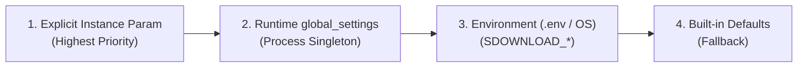

# Configuration & Global Settings Reference

This document outlines the **configuration architecture** of **SDownload**, the parameter precedence hierarchy, and a complete reference for all environment and runtime variables.

---

## 1. Configuration Precedence

SDownload follows a 4-tier precedence model to resolve settings:



$$\text{Instance Argument} > \text{Runtime } \texttt{global\_settings} > \text{Environment Variable } (\texttt{.env}) > \text{Built-in Default}$$

---

## 2. Settings Reference Matrix

| Domain | Environment Variable (`.env`) | Python Attribute (`global_settings`) | Default | Description |
| :--- | :--- | :--- | :---: | :--- |
| `Storage` | `SDOWNLOAD_DEFAULT_STORAGE_DIR` | `default_storage_dir` | `"storage"` | Base directory for downloaded and temporary files. |
| `Storage` | `SDOWNLOAD_DEFAULT_IO_BUFFER_SIZE_BYTES` | `default_io_buffer_size_bytes` | `1048576` *(1MB)* | Memory buffer size for disk I/O and chunk stitching (`merge_ranges`). |
| `Chunking` | `SDOWNLOAD_DEFAULT_CHUNK_SIZE_BYTES` | `default_chunk_size_bytes` | `1048576` *(1MB)* | Default slice size for range transfers. |
| `Chunking` | `SDOWNLOAD_MIN_CHUNK_SPLIT_SIZE_BYTES` | `min_chunk_split_size_bytes` | `2097152` *(2MB)* | Minimum remaining file size required to trigger multi-connection splitting. |
| `Chunking` | `SDOWNLOAD_MAX_SIMULTANEOUS_DOWNLOADS` | `max_simultaneous_downloads` | `10` | Maximum number of concurrent files in the download queue. |
| `Chunking` | `SDOWNLOAD_MAX_CONNECTIONS_PER_DOWNLOAD` | `max_connections_per_download` | `5` | Maximum concurrent chunk connections per file. |
| `Network` | `SDOWNLOAD_DEFAULT_TIMEOUT_CONNECT_S` | `default_timeout_connect_s` | `15.0` *(15s)* | Socket/TLS handshake connection timeout in seconds. |
| `Network` | `SDOWNLOAD_PROBE_TIMEOUT_S` | `probe_timeout_s` | `2.0` *(2s)* | Fast timeout for crawler resource exploration (`OPTIONS`/`HEAD`). |
| `Network` | `SDOWNLOAD_MAX_SCRAPE_SIZE_BYTES` | `max_scrape_size_bytes` | `1048576` *(1MB)* | Maximum HTML/JSON payload parsed into memory during link discovery. |
| `Network` | `SDOWNLOAD_MONITOR_UPDATE_INTERVAL_S` | `monitor_update_interval_s` | `0.5` *(0.5s)* | Frequency of speed (KB/s), progress (%), and ETA recalculations. |
| `Cache` | `SDOWNLOAD_FRESHNESS_TTL_SECONDS` | `freshness_ttl_seconds` | `86400` *(24h)* | Maximum age for a local file to be considered fresh (`SMART_REUSE`). |
| `Cache` | `SDOWNLOAD_CLOCK_SKEW_TOLERANCE_SECONDS` | `clock_skew_tolerance_seconds` | `300` *(5min)* | Allowed clock drift between local machine and remote `Last-Modified`. |

---

## 3. How to Configure in Python

### Option A: Modifying `global_settings` at Startup (Process-Wide)

Modify the global singleton before initializing downloader instances:

```python
from sDownload.global_settings import global_settings
from sDownload.services.downloader_manager import DownloaderManager

# 1. Customize global defaults at application startup
global_settings.default_storage_dir = "/data/downloads"
global_settings.max_simultaneous_downloads = 20
global_settings.default_chunk_size_bytes = 2 * 1024 * 1024  # 2MB
global_settings.freshness_ttl_seconds = 7 * 24 * 3600  # 7 days

# 2. All downstream services automatically inherit these values
manager = DownloaderManager()  # Uses max_simultaneous_downloads = 20
```

### Option B: Passing Explicit Config Objects (Per-Instance Override)

Pass configuration models directly to individual components to override global defaults:

```python
from sDownload.interfaces.models import DLManagerConfig, HttpConfigModel
from sDownload.services.downloader_manager import DownloaderManager

# Explicit configuration scoped only to this manager
custom_config = DLManagerConfig(
    max_simultaneous_downloads=50,
    max_connections_per_download=10,
)

manager = DownloaderManager(config=custom_config)
```

---

## 4. `.env.example` Template

Create a `.env` file in your project root to configure SDownload automatically without code changes:

```bash
# -------------------------------------------------------------
# SDownload Configuration Template
# -------------------------------------------------------------

# Storage & I/O
SDOWNLOAD_DEFAULT_STORAGE_DIR=storage
SDOWNLOAD_DEFAULT_IO_BUFFER_SIZE_BYTES=1048576

# Concurrency & Chunking
SDOWNLOAD_DEFAULT_CHUNK_SIZE_BYTES=1048576
SDOWNLOAD_MIN_CHUNK_SPLIT_SIZE_BYTES=2097152
SDOWNLOAD_MAX_SIMULTANEOUS_DOWNLOADS=10
SDOWNLOAD_MAX_CONNECTIONS_PER_DOWNLOAD=5

# Network & Crawler
SDOWNLOAD_DEFAULT_TIMEOUT_CONNECT_S=15.0
SDOWNLOAD_PROBE_TIMEOUT_S=2.0
SDOWNLOAD_MAX_SCRAPE_SIZE_BYTES=1048576
SDOWNLOAD_MONITOR_UPDATE_INTERVAL_S=0.5

# Cache & Freshness Policy
SDOWNLOAD_FRESHNESS_TTL_SECONDS=86400
SDOWNLOAD_CLOCK_SKEW_TOLERANCE_SECONDS=300
```
