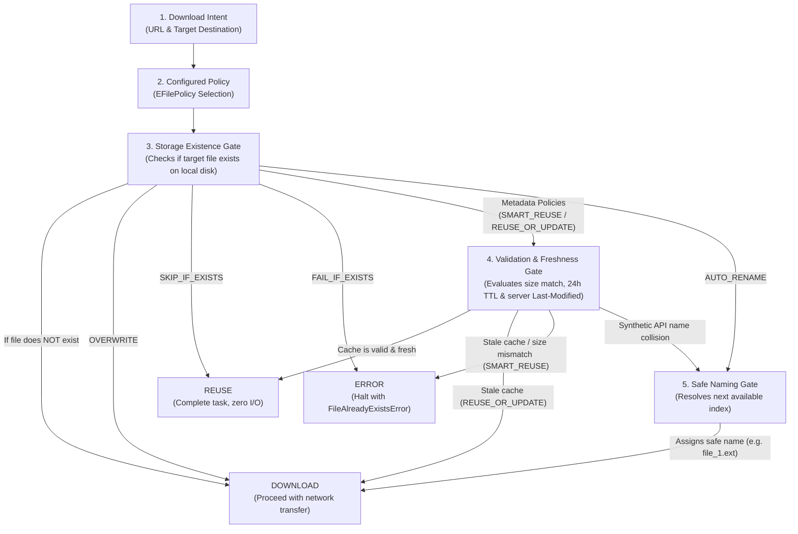
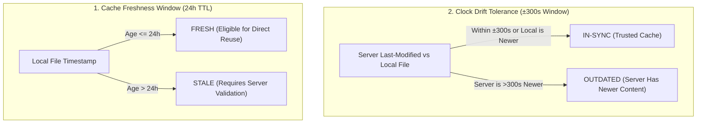
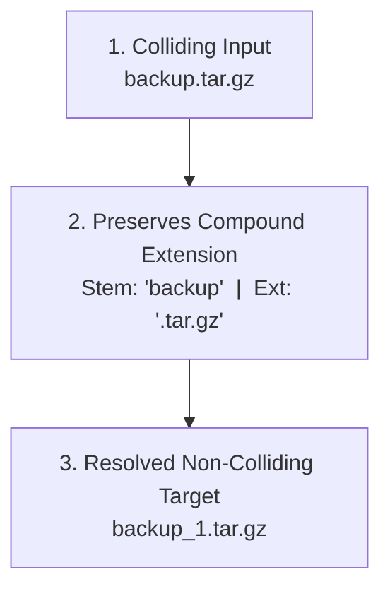

# File Policies & Collision Resolution

This document outlines the **file resolution engine** of **SDownload**, describing how destination files are inspected, validated for cache freshness, and protected against collisions before any network transfers or disk allocations occur.

---

## 1. The 3-Stage Resolution Pipeline

Before initiating a download, `resolve_file_policy` processes target files through a 3-stage pipeline to guarantee idempotency, cache reuse, and data safety:



---

## 2. Resolution Action Contract (`FilePolicyResolution`)

The pipeline evaluates inputs against the storage backend and returns a structured resolution contract:

| Action (`EFileAction`) | State Effect | Storage Footprint | Description |
| :--- | :---: | :---: | :--- |
| **`REUSE`** | Complete | Zero I/O | The local file is intact and fresh. The task completes immediately without network transfers. |
| **`DOWNLOAD`** | Active | Ingress Stream | Proceeds to download using `target_file_name` (original or auto-indexed). |
| **`ERROR`** | Failed | Blocked | Raises `FileAlreadyExistsError` due to policy collision, size mismatch, or stale cache. |

---

## 3. Unified Policy Matrix

All 7 policies (`EFilePolicy`) compared across evaluation behavior, cache handling, and operational use cases:

| Policy | Evaluation Type | If Target Exists Locally | Stale / Size Mismatch Action | Primary Use Case |
| :--- | :---: | :--- | :---: | :--- |
| **`OVERWRITE`** | Blind | Downloads to temp files and atomically replaces target | `DOWNLOAD` | CI/CD builds, temporary dumps |
| **`FAIL_IF_EXISTS`** | Blind | Immediately aborts with `FileAlreadyExistsError` | `ERROR` | Strict transactional pipelines and audit repositories |
| **`SKIP_IF_EXISTS`** | Blind | Skips transfer and marks task completed (`REUSE`) | `REUSE` | Web crawlers, mass scraping, and bulk dataset ingestions |
| **`AUTO_RENAME`** | Blind | Finds next available indexed name (`file_1.ext`) | `DOWNLOAD` | Desktop and browser download managers |
| **`REUSE_SAME_SIZE`** | Size-only | Reuses if local size exactly matches expected remote size | `ERROR` | Immutable static assets (ISOs, signed binaries, frozen datasets) |
| **`SMART_REUSE`** *(Default)* | Size + Time | Reuses if size matches AND file is fresh (<= 24h or >= server) | `ERROR` | Critical pipelines where stale or corrupted files must halt execution |
| **`REUSE_OR_UPDATE`** | Size + Time | Reuses if fresh; automatically re-downloads if stale | `DOWNLOAD` | Periodic mirror synchronization and scheduled recurring backups |

---

## 4. Freshness & Clock Drift Model

For time-aware policies (`SMART_REUSE` and `REUSE_OR_UPDATE`), cache validity is determined by comparing local creation time, remote `Last-Modified` timestamp, and current reference time:



### Trust Evaluation Rules
A local file is trusted (`REUSE`) if and only if:
1. **Size Match:** Local size matches remote `Content-Length`.
2. **Not Older than Remote:** Local timestamp is >= remote `Last-Modified` (within the 300s tolerance).
3. **Freshness Window:** Local file is younger than 24 hours **OR** explicitly newer than the remote server.

---

## 5. Smart Collision Renaming (`AUTO_RENAME`)

When a filename collision requires generating a new target name, SDownload uses a compound-extension parser (`_split_stem_and_extension`) to prevent breaking double extensions:

### Compound Extension Decomposition



### Supported Compound Formats

| Original Filename | Resolved Stem | Preserved Extension | Generated Safe Name |
| :--- | :--- | :--- | :--- |
| `archive.tar.gz` | `archive` | `.tar.gz` | `archive_1.tar.gz` |
| `payload.tar.zst` | `payload` | `.tar.zst` | `payload_1.tar.zst` |
| `initramfs.cpio.xz` | `initramfs` | `.cpio.xz` | `initramfs_1.cpio.xz` |
| `userscript.user.js` | `userscript` | `.user.js` | `userscript_1.user.js` |
| `release.1.0.0.zip` | `release.1.0.0` | `.zip` | `release.1.0.0_1.zip` |
| `Makefile` *(no ext)* | `Makefile` | `""` | `Makefile_1` |
| `.gitignore` *(dotfile)* | `.gitignore` | `""` | `.gitignore_1` |

---

## 6. Synthetic Endpoint Protection (`is_generated_name`)

When downloading from generic API endpoints (e.g., `https://api.domain.com/v1/export`), no explicit filename is declared by the URL, prompting SDownload to synthesize a fallback name (`export.bin`).

### The Cross-Endpoint Collision Risk
If multiple unrelated API calls generate `export.bin`, subsequent tasks could mistakenly reuse an unrelated local file or overwrite previous exports.

### The Defensive Rule
Under `SMART_REUSE` and `REUSE_OR_UPDATE`:
- If an existing local file shares the synthetic fallback name **AND** the size cannot be verified:
- SDownload automatically shifts from in-place evaluation to **isolated auto-renaming** (`export_1.bin`), preventing cross-endpoint data corruption.

---

## 7. How to Use in Python

Pass the desired `EFilePolicy` to `DownloadParams` when configuring your download:

```python
from sDownload.interfaces.models import DownloadParams, EFilePolicy
from sDownload.services.downloader_manager import DownloadTask

# 1. Configure the download task with a specific file policy
params = DownloadParams(
    url="https://example.com/data/report.tar.gz",
    policy=EFilePolicy.AUTO_RENAME,  # e.g., OVERWRITE, SMART_REUSE, AUTO_RENAME
)

# 2. Initialize and run the task
task = DownloadTask(params=params)
await task.start()
```
